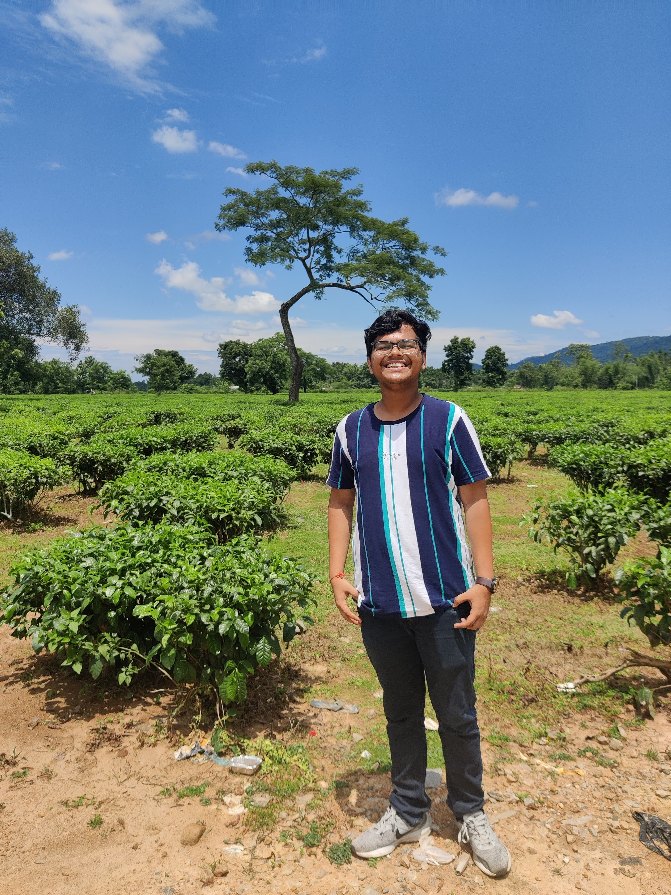

+++
title = 'My First Post'
date = 2023-09-19T00:03:15+05:30
draft = false
+++

Hey! I suppose it's your first time here. Welcome to my blog 😄. I am Gunjan Dhanuka, a CS undergrad at IIT Guwahati, who is into a lot of stuff like gaming, photography, consuming YouTube content (and creating my own too 😇), and travelling!

So I have written some stuff in the past on Quora and Medium, but just before the night of my Hardware Security Midsems, an interesting thought strikes me.

*Why don't I start my own blog?*

And honestly, I am quite keen on seeing how this turns out. I have loads of stuff to write about, be it the nerd in me that wants to write about competitive exams and CS, or my free soul wanting to document the many experiences that define me. 

I will try to be as regular as possible, and not let this one die out (like Quora/Medium). Feel free to hangout here, and connect with me for a quick chat over LinkedIn/Instagram.

